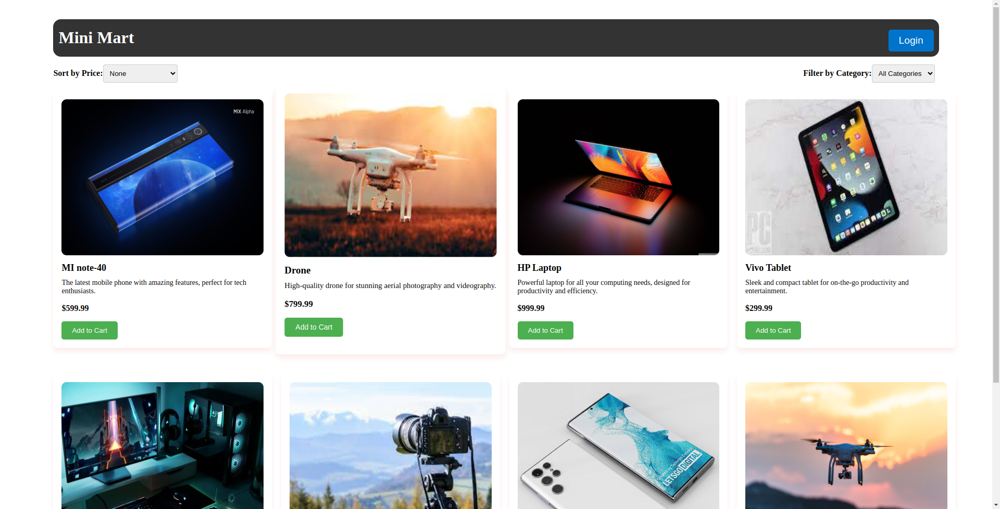

<!-- README.md -->
# Mini Mart
# [Live Demo](https://mini-mart-client.vercel.app/)

[Description](#description) | [Installation](#installation) | [Usage](#usage) 

## Description
This is a simple design online shopping website. People can purchase a item from this website and they can save it locally and use it next time.

## Installation
This is a React (vite) project. I first time used styled components for styled my website, I use react toastify for show toast , and I also use React Paginate for pagination . 

## Usage 
type this command "npm run dev" and show this website locally.
